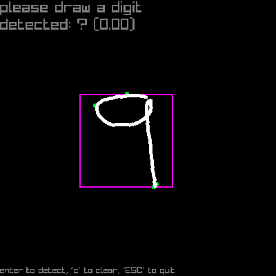

# jmyml
We learn sycl and machine learning algorithms from scratch together!

## build & run
You need `git lfs` if you want to work with the datasets provided.
This software is clearly dependent on a working sycl compiler.
Please install one, such as AdaptiveCpp or intel oneAPI DPC++.
Then copy `CMakeUserPresets.json.example` to `CMakeUserPresets.json` and set the compiler to the correct path.
Now you can build using:

```
cmake --preset sycl-BUILD_TYPE
cmake --build --preset sycl-BUILD_TYPE
```

where `BUILD_TYPE` is one of `debug` and `release`.
As the GUI applications build raylib, you can opt out of building them by setting `-DJMYML_BUILD_GUI=OFF`.

## Executables
### idxview
GUI interface visualizing any idx file of rank at least 2, i.e. a collection of images in uncompressed grayscale format. This is very useful for example to visualize the MNIST dataset located in this repository under `data/mnist`.
LEFT/RIGHT arrow keys page through more images.


### mldraw
GUI interface to draw numbers with your mouse, which then are detected by a machine learning model implemented with this library.



